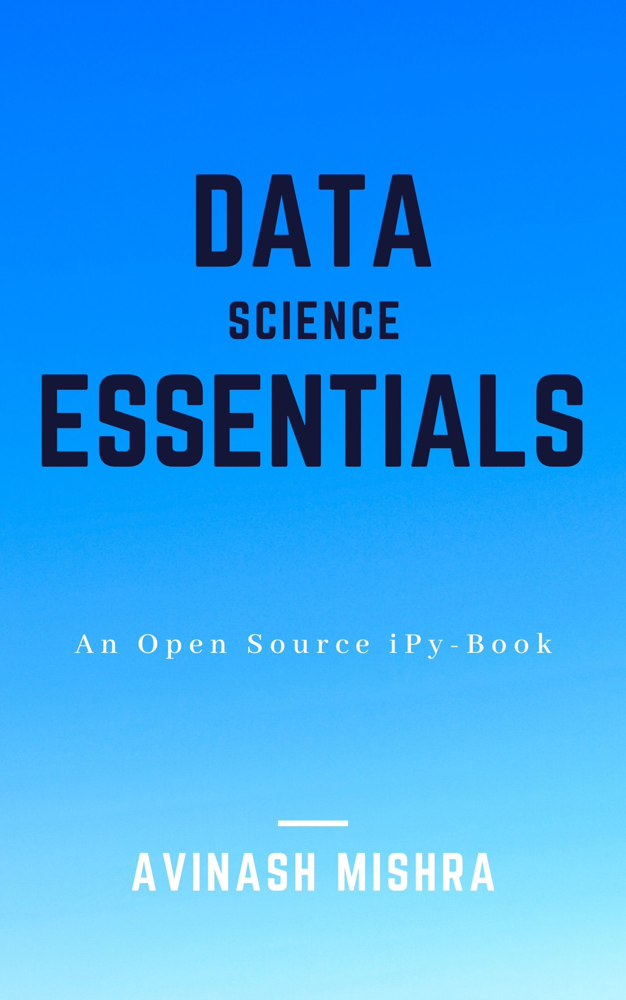

# Data-Science-Essentials

Alpha version (in-progress)

An open source ipy-book on Data Science. 

DISCLAIMER: This ipy book has been created as per my knowledge of Data Science in industry utilizing various open source datas and tutorials. This book is not obliged for any copy right issue because it's main purpose is to spread consolidated and single point resources of Data Science materials. 

Credits: Kaggle community, Github, Gist and various blogs and resources. 
